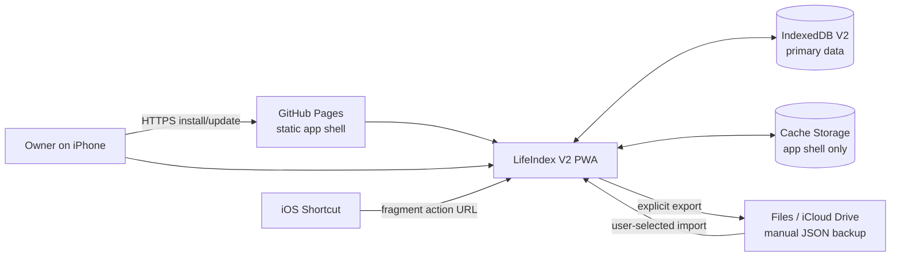
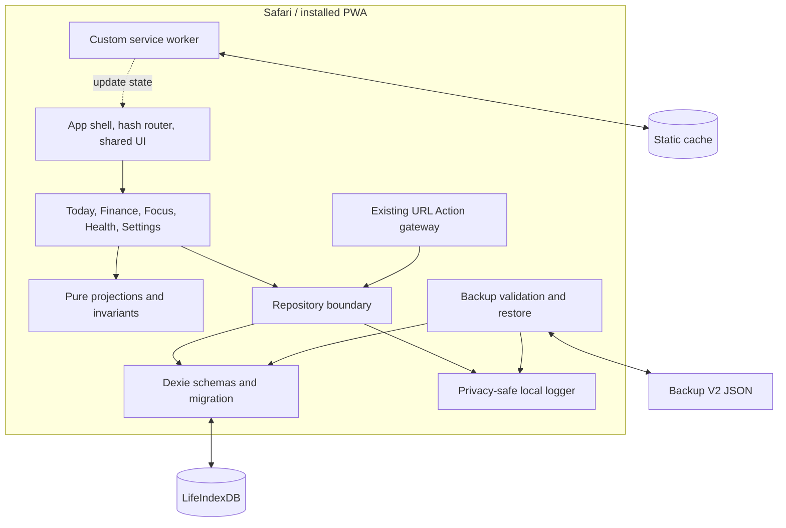
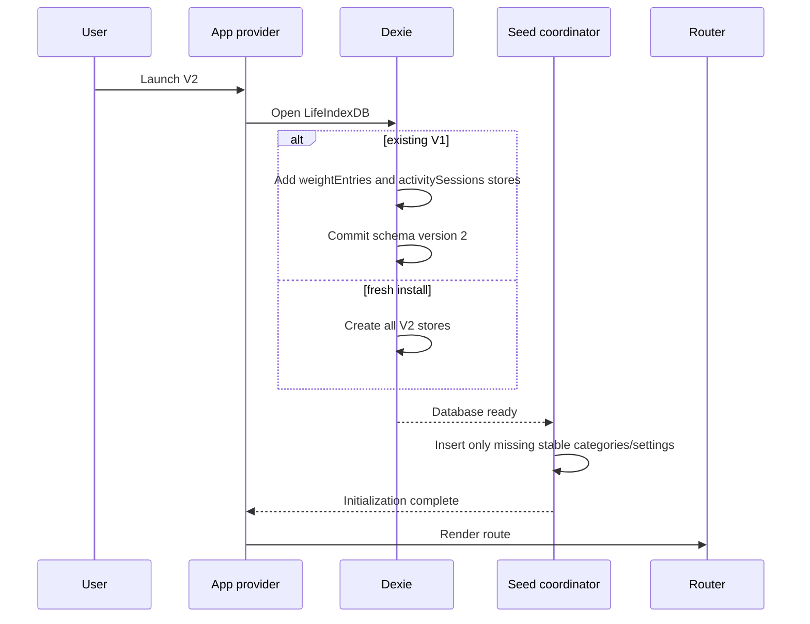
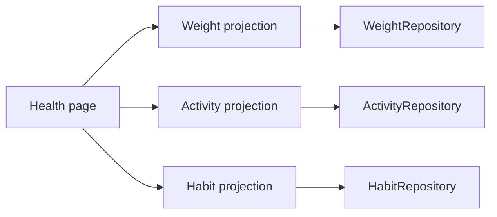
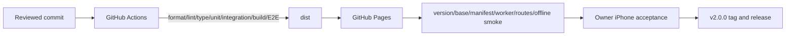

# LifeIndex V2 High-Level Design

**Status:** Accepted and frozen at gate G2

**Date:** 2026-09-06

## 1. Architecture goals

- Preserve every V1 business record during an additive V2 upgrade.
- Keep IndexedDB as the only primary database and preserve offline capture.
- Add lightweight Health records without coupling Habits, Finance, or Focus persistence.
- Deliver a calm mobile UI from one static artifact at localhost and the GitHub Pages `/LifeIndex/` subpath.
- Keep backup validation and atomic recovery ahead of feature velocity.

## 2. System context



GitHub hosts application code only. Health, finance, habit, focus, and backup content is never transmitted by application logic.

## 3. Container view



## 4. Module boundaries

| Module | Owns | Must not own |
| --- | --- | --- |
| `app` | bootstrap, providers, routes, compact shell, global recovery | domain records or statistics |
| `features/today` | daily read projection and quick routing | independent Today persistence |
| `features/finance` | calendar/ledger UI, transaction projections and commands | float money or raw table access |
| `features/health` | Health composition, weight/activity UI and projections | changing Habit semantics or medical advice |
| `features/habits` | reusable Habit lifecycle, check-in, streak/heatmap | weight/activity records |
| `features/focus` | timer setup, transitions, history and summaries | interval-based business time |
| `features/settings` | category/appearance/data-safety/other groups | hidden capture or cloud sync |
| `data/db` | schema versions, additive upgrade, table ownership, seed boundary | UI recovery copy |
| `data/repositories` | validated commands, referential checks, bounded reads | presentation state |
| `data/backup` | version migration, current validation, atomic replacement | automatic upload or merge |
| `app/actions` | retained allowlisted fragment actions and receipts | Health actions in V2 |
| `pwa` | shell cache, update/offline state | business-data caching |
| `shared` | typed values, dates, money/weight parsing, logging, UI primitives | feature policy that belongs to a domain |

Features may compose repository results but do not import another feature's page component. Health may reuse Habit presentation primitives and pure habit-domain functions; the persisted Habit model remains owned by its existing repository.

## 5. Startup and database upgrade



The V1-to-V2 upgrade contains no row transformation, clear, delete, or default personal value. Dexie owns upgrade atomicity. If open/upgrade/seed fails, normal routes remain blocked, the database is not deleted, and a typed safe recovery state is shown.

## 6. Data architecture

- Database: `LifeIndexDB`.
- Dexie schema: version 2.
- V1 stores retained exactly: `categories`, `transactions`, `habits`, `habitRecords`, `focusSessions`, `settings`, `actionReceipts`.
- V2 additive stores: `weightEntries`, `activitySessions`.
- Weight: integer grams; UI renders kilograms.
- Activity duration: integer minutes; category references `domain=activity`.
- Local-calendar behavior: `YYYY-MM-DD` keys plus captured UTC instant and timezone offset.
- Derived totals, trends, heatmap cells, and chart points are never persisted as truth.

Normative fields, indexes, and invariants are in [DATA_MODEL.md](DATA_MODEL.md). [ADR-0007](../adr/0007-v2-health-storage-and-backup.md) records the compatibility decision.

## 7. Write and read paths

```text
form input
  → canonical parser/schema
  → repository command
  → reference check inside Dexie transaction
  → IndexedDB commit
  → privacy-safe result event
  → live-query refresh
```

The UI disables duplicate submission and displays final success only after commit. Failure keeps the form and draft in memory. Logs identify entity type, operation, state, counts, versions, and failure class only; they exclude values and IDs.

Repositories expose date-range/status/domain queries. Pure feature functions derive:

- calendar day nets and monthly Finance summaries;
- latest/30-day weight direction;
- Monday–Sunday Activity totals;
- Habit streaks, rate, and fourteen-week heatmap;
- timestamp-based Focus status and summaries.

Loading and failed reads remain explicit and are not normalized to empty arrays at the UI boundary.

## 8. Health composition

Health combines three independently queryable sources:



One source failure does not suppress the other sections. Weight and Activity forms use independent repository transactions. The shared Health add chooser only routes to those existing flows or Habit creation.

## 9. Finance calendar architecture

The Finance repository continues to provide bounded local-date records. A pure calendar projection fills the visible month grid, groups transactions by `localDate`, and sums exact integer minor units. Selected date and visible month are ephemeral route/page state; they are not Settings or database records.

The new sheet uses the same validated TransactionRepository as V1. No financial schema change is required.

## 10. Backup and restore

Export writes format V2 with all nine stores. Import accepts V0, V1, and V2:

```text
untrusted bytes
  → size/JSON/header validation
  → V0→V1 migration when required
  → V1→V2 migration when required
  → strict current V2 schemas
  → uniqueness/count/reference/state checks
  → in-memory preview token
  → explicit user confirmation
  → one nine-store clear-and-insert transaction
```

Older migrations add empty `weightEntries` and `activitySessions`; they never infer weight, target, activity, or category values. Restore failure aborts and retains all pre-restore data. The normative envelope is [BACKUP_SCHEMA.md](BACKUP_SCHEMA.md).

## 11. Focus, PWA, and URL Action continuity

- Focus keeps its persisted timestamp state machine and one-active-row invariant.
- The service worker still precaches only the app shell and exposes ready/update/failure state.
- Update activation remains explicit and dirty-form aware.
- Add-transaction, check-habit, and start-focus fragment actions remain atomic with receipts.
- V2 adds no Health URL action and no network data source.

## 12. Security and privacy

- No remote telemetry, analytics, API, error reporter, or third-party content request.
- CSP and build artifact remain static-host compatible.
- Health logs exclude weight, target, intensity, activity/category values, dates tied to records, notes, and IDs.
- Backup content is untrusted data and is never rendered as HTML or logged.
- Test fixtures are synthetic and excluded from production artifacts when not required.
- Anyone may load a blank shell from the public URL, but one browser profile cannot read another profile's IndexedDB through LifeIndex.

## 13. Failure and rollback boundaries

- **Initialization/migration:** block routes; never auto-delete/recreate.
- **Repository write:** transaction rollback; keep draft and show retry.
- **Projection read:** section-level error; never false zero.
- **Restore validation:** no write transaction begins.
- **Restore write:** all nine stores roll back atomically.
- **Source rollback after V2 use:** deploy may roll back code, but V1 code is not guaranteed to open schema V2; recovery is a forward-compatible V2 fix, never data clearing.
- **Service-worker update:** explicit activation and reload; existing IndexedDB remains outside cache lifecycle.

## 14. Deployment and quality



No generated `dist`, backup, personal record, credential, or IndexedDB export is committed. Physical-iPhone results are recorded only from the owner.
