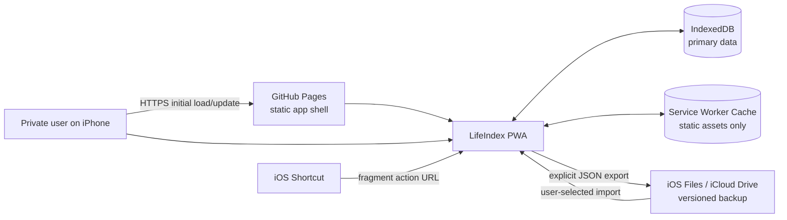
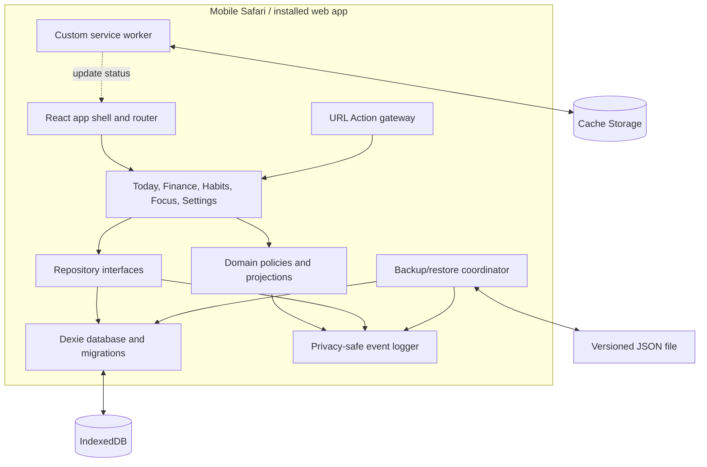
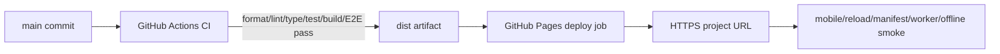

# LifeIndex V1 High-Level Design

**Status:** Accepted for implementation

**Date:** 2026-09-03

## 1. Architecture goals

- Keep personal records on the current device and usable offline.
- Make schema evolution and recovery safer than feature velocity.
- Keep daily capture fast and feature modules independently understandable.
- Build one static artifact that works at localhost and a GitHub Pages project subpath.
- Preserve a small extension surface for future life-index domains without building them in V1.

## 2. System context



GitHub receives static source/artifacts but no application records. Files/iCloud Drive receives data only when the user explicitly exports a backup.

## 3. Container view



## 4. Module boundaries

| Module              | Owns                                                                                      | Must not own                              |
| ------------------- | ----------------------------------------------------------------------------------------- | ----------------------------------------- |
| `app`               | Bootstrap, dependency composition, hash router, global boundaries, update/offline banners | Business records or statistics rules      |
| `features/today`    | Read-only daily projections and quick-action composition                                  | Independent Today persistence             |
| `features/finance`  | Transaction/category commands, lists, finance summaries                                   | Raw Dexie access or floating-point money  |
| `features/habits`   | Habit lifecycle, check-in, schedules, streaks/calendar                                    | UTC-derived calendar-day behavior         |
| `features/focus`    | Timer configuration/state transitions, session history/statistics                         | Callback-count-based elapsed time         |
| `features/settings` | Data safety, organization links, appearance, version display                              | Hidden daily capture actions              |
| `data/db`           | Dexie stores, versions, migrations, transaction primitives                                | UI messages or feature rendering          |
| `data/repositories` | Typed persistence APIs and query boundaries                                               | Presentation state                        |
| `data/backup`       | Envelope validation, migrations, referential checks, atomic replace                       | Automatic cloud upload or merge semantics |
| `app/actions`       | Fragment parsing, allowlist, validation, preview commands, receipt lookup                 | Silent business mutation                  |
| `pwa`               | Worker registration, update readiness, online/offline status                              | Business-data caching                     |
| `shared`            | Types, dates, money, validation helpers, logger, UI primitives                            | Feature-specific rules                    |

Dependencies flow inward from views to feature/domain contracts and from repositories to the storage adapter. Feature modules do not import one another's components; Today composes read-model interfaces.

## 5. Startup flow

```mermaid
sequenceDiagram
    participant U as User
    participant A as App shell
    participant D as Database
    participant R as Router/actions
    participant S as Service worker

    U->>A: Launch
    A->>A: Install error/log boundary
    A->>D: Open LifeIndexDB
    D->>D: Apply required schema upgrades
    alt database ready
        D-->>A: Repositories ready
        A->>R: Resolve hash route/action
        A->>S: Register worker and subscribe to status
        A-->>U: Render destination
    else open or migration failure
        D-->>A: Typed safe error
        A-->>U: Recovery screen; no false success
    end
```

Default seed data is inserted idempotently only after the schema is ready. Seed failure aborts initialization rather than leaving a partially assumed setup.

## 6. Data architecture

- Database: `LifeIndexDB`.
- Current Dexie schema: version 1.
- Stores: `categories`, `transactions`, `habits`, `habitRecords`, `focusSessions`, `settings`, `actionReceipts`.
- IDs: random UUID strings generated with `crypto.randomUUID()`.
- Audit timestamps: UTC ISO 8601 strings.
- Human calendar semantics: `YYYY-MM-DD` local date keys computed from the user's local date input.
- Money: positive integer minor units plus the application currency setting.
- No logs, caches, derived totals, or chart points are persisted as business truth.

Details and indexes are normative in `DATA_MODEL.md`.

## 7. Write path

```text
view input
  -> Zod command validation/canonicalization
  -> pure domain invariant
  -> feature repository interface
  -> Dexie transaction
  -> privacy-safe success/failure event
  -> reactive query refresh
```

The UI acknowledges success only after the IndexedDB transaction resolves. A failed write preserves safe form state in memory and never updates the view as if persistence succeeded.

## 8. Read and projection path

Repositories expose bounded queries by local date, time range, status, and domain. Feature services calculate totals and streaks as pure projections. Today requests three daily projections; it does not copy records into another store.

Dexie live queries may notify hooks of relevant changes, but repository interfaces remain the boundary so tests can use in-memory fakes for pure UI cases and `fake-indexeddb` for integration cases.

## 9. Backup and restore architecture

```mermaid
sequenceDiagram
    participant U as User
    participant B as Backup coordinator
    participant V as Schema/reference validator
    participant D as Dexie

    U->>B: Select JSON file
    B->>V: Parse and migrate in memory
    alt invalid
        V-->>U: Sanitized validation summary
    else valid
        V-->>U: Version/time/count preview
        U->>B: Confirm replace
        B->>D: Begin transaction across all stores
        D->>D: Clear and bulk insert validated snapshot
        alt any failure
            D->>D: Abort transaction
            D-->>U: Existing data retained; retry guidance
        else committed
            D-->>U: Restored counts and refresh
        end
    end
```

The backup format and import checks are normative in `BACKUP_SCHEMA.md`. Restore does not merge in V1.

## 10. Focus time architecture

The active session is a persisted `focusSessions` row with `status=active`, `startedAt`, and `plannedDurationSeconds`. The displayed remaining time is recalculated from `now - startedAt`; a one-second UI tick only requests a repaint and is never the time source.

On app resume/start:

- If no active row exists, show idle.
- If now is before the target end, resume display from timestamps.
- If now is at/after target end, atomically finalize at the target end unless already completed.
- Early finish finalizes at the user's current timestamp.
- Cancel deletes the active row after confirmation.

## 11. Offline and update architecture

The custom service worker precaches `index.html`, hashed JS/CSS, manifest, and required icons. It does not cache IndexedDB records or an API response because no V1 API exists.

The worker lifecycle is surfaced to the app:

- Ready offline: non-blocking confirmation on first cache completion.
- Update waiting: show prompt.
- Update discovery: visible online clients check again when returning to the foreground or reconnecting, with duplicate/recent-check suppression; this does not activate the worker.
- Dirty form: defer activation or request explicit discard/save choice.
- Active focus: safe because active state is persisted; still avoid surprise reload.
- Registration/update failure: log safe context and continue online/local operation where possible.

## 12. Security and privacy

- No remote telemetry, analytics, error reporting, or business-data fetch.
- Content Security Policy limits resources to the static app's needs; no inline executable script.
- URL Actions live entirely in the fragment, require confirmation, and use durable receipts.
- Logs allow event names, versions, record counts, action/state types, generated correlation IDs, and sanitized error classes; they exclude business entity IDs and field values.
- Backups are treated as untrusted input and never rendered as HTML.
- Test fixtures are synthetic and visually marked as test data.

This is not authenticated software. Anyone with the Pages URL may load a blank app shell and create their own browser-local records.

## 13. Error taxonomy

- `InitializationError`: app/database cannot become ready.
- `ValidationError`: form, URL Action, or backup violates a schema/invariant.
- `PersistenceError`: a repository transaction fails.
- `MigrationError`: database or backup migration cannot preserve a supported version.
- `RestoreError`: validated restore transaction fails/aborts.
- `PwaError`: worker registration, caching, or update activation fails.

Errors cross layers as typed safe objects with a correlation ID, operation/event name, and cause class. User copy never includes raw backup content or browser stack traces.

## 14. Deployment architecture



The Pages job receives `contents: read`, `pages: write`, and `id-token: write`; CI jobs receive only read access. Generated `dist` is never committed.

## 15. Observability without telemetry

The central logger emits structured events to the local browser console. Production defaults to lifecycle, warning, and error events; verbose query/render events remain development-only. Key events include:

- app initialization start/ready/failure
- database open/version/upgrade success/failure
- repository mutation start/success/failure by operation and entity type
- focus state transition
- backup export/import stage and counts
- URL Action parsed/rejected/previewed/handled/duplicate
- service-worker ready/update/error

No production event contains a business entity ID, amount, note, title, habit name, category name, URL fragment, or backup payload.

## 16. Quality strategy

- Pure unit tests: dates, money, schedules, streaks, statistics, schemas, state machines.
- Component tests: forms, errors, navigation, update prompts, accessibility.
- Repository integration: Dexie over `fake-indexeddb`, transactions, indexes, restore rollback.
- Production E2E: Chromium for broad feedback and Mobile Safari/WebKit for primary compatibility.
- Deployed smoke: base path, manifest, worker, reload, offline.
- Physical acceptance: user's actual iPhone; required before `v1.0.0`.
