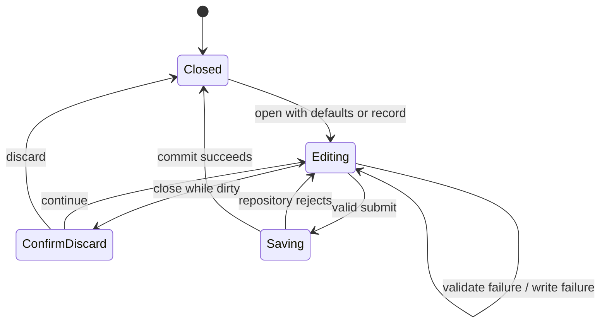

# LifeIndex V2 Low-Level Design

**Status:** Accepted and frozen at gate G2

**Date:** 2026-09-06

## 1. Source layout

```text
src/
├── app/                       # bootstrap, providers, routes, shell, actions
├── data/
│   ├── db/                    # Dexie V1/V2 schemas and seeds
│   ├── repositories/          # Finance, Focus, Habit, Weight, Activity, Settings
│   └── backup/                # V0/V1/V2 parsing and atomic restore
├── features/
│   ├── today/
│   ├── finance/
│   ├── focus/
│   ├── health/                # composition, weight/activity forms and projections
│   ├── habits/                # retained reusable habit domain/UI
│   └── settings/
├── pwa/
├── shared/
│   ├── domain/
│   ├── logging/
│   ├── ui/                    # icons, sheet/dialog, rows and feedback
│   └── validation/
└── styles/
```

Directories are introduced with real implementation/tests only.

## 2. Dependency composition

`AppProviders` owns one application-lifetime `LifeIndexDatabase`. Repositories may be constructed in a page or service factory from that verified database; table objects never cross into JSX. Clock and ID generators remain injectable.

```ts
interface AppServices {
  database: LifeIndexDatabase
}
```

The minimal provider contract is intentional: repositories remain small value objects and integration tests can inject a uniquely named database.

## 3. Database V2 declaration

```ts
const databaseSchemaV1 = { /* shipped seven-store schema */ }

const databaseSchemaV2 = {
  ...databaseSchemaV1,
  weightEntries: 'id,measuredAt,localDate,updatedAt',
  activitySessions: 'id,occurredAt,localDate,categoryId,intensity,updatedAt',
}

this.version(1).stores(databaseSchemaV1)
this.version(2).stores(databaseSchemaV2)
```

Both declarations remain registered so Dexie can open fresh and V1 databases. No V2 `.upgrade()` row transform is needed because stores are additive. Initialization then inserts missing stable Activity categories in the existing idempotent seed transaction. Logs record schema version, operation, count, and safe failure class.

## 4. Repository contracts

### WeightRepository

```ts
interface WeightRepository {
  create(command: SaveWeightEntry): Promise<WeightEntry>
  update(id: string, command: SaveWeightEntry): Promise<WeightEntry>
  remove(id: string): Promise<void>
  get(id: string): Promise<WeightEntry | undefined>
  list(range: LocalDateRange): Promise<WeightEntry[]>
  latest(): Promise<WeightEntry | undefined>
}
```

Create/update strictly validates grams, instant/local-date/offset consistency fields, and note boundaries. List is newest `measuredAt` first. Delete is idempotent at persistence level but UI requires confirmation.

### ActivityRepository

```ts
interface ActivityRepository {
  create(command: SaveActivitySession): Promise<ActivitySession>
  update(id: string, command: SaveActivitySession): Promise<ActivitySession>
  remove(id: string): Promise<void>
  get(id: string): Promise<ActivitySession | undefined>
  list(range: LocalDateRange): Promise<ActivitySession[]>
}
```

Create/update validates the Activity category inside the same read/write transaction. Archived categories are valid for historical update only when the record already references that category; new/reclassified capture requires active categories. List is newest `occurredAt` first.

### Retained repositories

TransactionRepository, HabitRepository, FocusRepository, CategoryRepository, SettingsRepository, and ActionService retain their V1 contracts. CategoryDomain expands to `activity`; Activity categories have no `transactionType`. Category reorder remains limited to one matching domain/type/archive group.

## 5. Health projections

Pure functions accept already-bounded arrays:

```ts
interface WeightTrend {
  latest?: WeightEntry
  deltaGrams?: number
}

interface ActivitySummary {
  count: number
  durationMinutes: number
}
```

- `summarizeWeightTrend(entries, today)` finds the latest record and earliest record from `today - 29` through today; a delta exists only with at least two records.
- `summarizeActivities(entries)` sums whole minutes with safe-integer checking.
- `parseWeightToGrams(text)` accepts digits plus one decimal separator and at most three decimal kg places, then validates 20,000–500,000 grams without floating-point multiplication.
- `formatWeightGrams` renders one-decimal kg for the UI while exact grams remain persisted/exported.
- Habit streak/rate logic is reused unchanged. A new pure fourteen-week projection maps scheduled/completed local dates to accessible heatmap cells.

## 6. Finance calendar projection

`buildMonthCalendar(monthKey, selectedDate, transactions)` returns leading/trailing placeholders plus actual local dates, per-day income/expense/net minor units, today/selected flags, and weekday labels. It uses calendar components, never fixed-duration milliseconds. Month navigation clamps the selected day and issues no database write.

The Finance page keeps one month query for calendar/totals/reports and derives the selected-day ledger from that result. Add/edit use the existing TransactionRepository and shared form draft.

## 7. Routing and shell

- Replace `/habits` destination with `/health` and add a replace redirect from `/habits`.
- Health page is route-lazy-loaded.
- Optional Health nested routes may begin as page-owned state; any addressable detail route must preserve browser back behavior.
- Bottom navigation uses an internal allowlisted SVG icon component; no external font/icon network request.
- The compact header derives its title from the active route and keeps accessible heading order inside pages.

## 8. Sheet/dialog state machine



Each form registers a stable dirty token with the PWA provider. `Saving` disables duplicate submit. Success messages never precede commit. Focus returns to the opening control on close. At compact height, the sheet remains scrollable above the safe area and keyboard.

## 9. Backup V2 types and migration

```ts
interface LifeIndexBackupV2 {
  format: 'lifeindex-backup'
  formatVersion: 2
  appVersion: string
  exportedAt: string
  source: BackupSource
  counts: BackupCountsV2
  data: BackupDataV2
}
```

Migration pipeline:

1. Parse only the common header.
2. If V0, validate against the frozen V0 schema and add empty `actionReceipts` to create V1.
3. If V1, validate against the frozen V1 schema and add empty `weightEntries`/`activitySessions` to create V2.
4. Parse strict V2 fields and run uniqueness, count, state, and reference checks.
5. Keep canonical data behind a one-time, 15-minute in-memory preview token.
6. Revalidate before replacing all nine stores in one transaction.

Legacy schemas must not reuse a current schema in a way that accidentally requires future fields. Export emits V2 only.

## 10. Reference and state validation

- Transaction → existing matching Finance category.
- Focus category → existing Focus category when present.
- Activity → existing Activity category, archived allowed for historical import.
- HabitRecord → existing Habit.
- ActionReceipt → existing transaction/habitRecord/focusSession by action type.
- At most one active Focus session.
- Unique primary IDs and unique Habit/date compound keys.
- Setting keys unique; optional `weightTarget` appears at most once.

## 11. Settings contract

```ts
type Setting =
  | ExistingV1Settings
  | { key: 'weightTarget'; value: { weightGrams: number }; updatedAt: string }
```

Absence of `weightTarget` means no target. It is not seeded. Appearance remains a separate group and still applies immediately. Category management adds Activity as a fourth group.

## 12. Safe logging

New events follow the retained logger contract:

- `weight.create|update|delete|list.*`
- `activity.create|update|delete|list.*`
- `health.projection.*`
- `database.initialization.*` with schema version 2
- `backup.*` with format version 2

Allowed context includes operation, entity type, count, prior/next state, format/schema version, and failure class. Never pass entity IDs, grams, target, duration, intensity, category/name/title/note values, local dates tied to records, payloads, or fragments.

## 13. Error handling

- Zod/domain errors map to field or safe form messages.
- Repository failures preserve the current draft and emit one sanitized failure event.
- Health section reads fail independently.
- Database upgrade failure keeps the initialization boundary active and offers retry; it does not create a replacement database.
- Backup inspect/migrate/validate failure has no write side effect.
- Atomic restore failure reports that current data was retained.

## 14. Testing seams

- Injected clock/UUID and unique fake-indexeddb database names.
- Synthetic schema-V1 database fixture opened by V2 code.
- Frozen V0/V1 backup builders and current V2 builder.
- Forced table insertion failure during nine-store restore.
- Pure calendar, weight parser/trend, activity summary, and heatmap functions.
- React component tests for navigation, independent Health states, sheets, settings order, and draft retention.
- Production Playwright at 320 × 568 and iPhone-class WebKit/Chromium viewports.

## 15. Implementation sequence

1. Add current types, validation, Dexie V2 declaration, seed activity categories, repositories, backup V2 migration, and integration tests.
2. Add shared visual tokens/icons/sheet and V2 shell.
3. Implement Today and Finance calendar/entry.
4. Implement Health weight/activity plus retained Habits/detail.
5. Refresh Focus and Settings.
6. Run migration rehearsal, full local/E2E gates, deployed smoke, and owner-led iPhone acceptance.
