# LifeIndex V1 Low-Level Design

**Status:** Accepted for implementation

**Date:** 2026-09-03

## 1. Proposed source layout

```text
src/
├── app/
│   ├── App.tsx
│   ├── AppProviders.tsx
│   ├── routes.tsx
│   ├── actions/
│   └── errors/
├── data/
│   ├── db/
│   │   ├── LifeIndexDatabase.ts
│   │   ├── schema.ts
│   │   ├── migrations/
│   │   └── seeds.ts
│   ├── repositories/
│   └── backup/
├── features/
│   ├── today/
│   ├── finance/
│   ├── habits/
│   ├── focus/
│   └── settings/
├── pwa/
├── shared/
│   ├── domain/
│   ├── logging/
│   ├── ui/
│   └── validation/
├── styles/
├── main.tsx
└── sw.ts
tests/
├── fixtures/
├── integration/
└── e2e/
```

Create directories only with their first real implementation or test; this diagram defines ownership rather than requiring empty placeholders.

## 2. Dependency composition

`main.tsx` installs the earliest safe logger and renders `AppProviders`. In M4 the provider opens one application-lifetime database and blocks normal routing behind explicit loading/failure states. M5 composes the repository set, appearance, and feature query controllers on this verified database boundary; M6 adds live PWA update state.

```ts
interface AppServices {
  categories: CategoryRepository
  transactions: TransactionRepository
  habits: HabitRepository
  focus: FocusRepository
  settings: SettingsRepository
  actions: ActionReceiptRepository
  backup: BackupService
  logger: SafeLogger
  clock: Clock
  idGenerator: IdGenerator
}
```

`Clock` and `IdGenerator` are injectable to make local-date, timer, and idempotency tests deterministic.

## 3. Repository contracts

### TransactionRepository

```ts
interface TransactionRepository {
  create(command: CreateTransaction): Promise<Transaction>
  update(id: string, command: UpdateTransaction): Promise<Transaction>
  remove(id: string): Promise<void>
  get(id: string): Promise<Transaction | undefined>
  list(range: LocalDateRange): Promise<Transaction[]>
}
```

Create/update validates the command, resolves the category inside the transaction, checks domain/type, canonicalizes money/date fields, writes, and emits safe lifecycle logs. List returns newest `occurredAt` first.

### HabitRepository

```ts
interface HabitRepository {
  create(command: CreateHabit): Promise<Habit>
  update(id: string, command: UpdateHabit): Promise<Habit>
  setStatus(id: string, status: HabitStatus): Promise<Habit>
  listAll(): Promise<Habit[]>
  listScheduled(localDate: string): Promise<Habit[]>
  checkIn(command: CheckInHabit): Promise<HabitRecord>
  undoCheckIn(habitId: string, localDate: string): Promise<void>
  listRecords(habitId: string, range: LocalDateRange): Promise<HabitRecord[]>
}
```

Check-in verifies habit existence/schedule and inserts under the compound unique invariant. A uniqueness race resolves to the existing record and logs an idempotent branch rather than an exception.

### FocusRepository

```ts
interface FocusRepository {
  start(command: StartFocus): Promise<FocusSession>
  getActive(): Promise<FocusSession | undefined>
  reconcileActive(now: string): Promise<FocusSession | undefined>
  finishEarly(id: string, now: string): Promise<FocusSession | undefined>
  cancel(id: string): Promise<void>
  updateDetails(id: string, command: UpdateFocusDetails): Promise<FocusSession>
  removeCompleted(id: string): Promise<void>
  listCompleted(range: LocalDateRange): Promise<FocusSession[]>
}
```

Start, reconcile, finish, and cancel use write transactions so two UI events cannot create conflicting transitions.

## 4. Query hooks and reactive updates

Each feature owns hooks that subscribe to a repository query using Dexie `liveQuery` or a narrowly wrapped equivalent. Hooks expose `{status, data, error}` and cancel subscriptions on unmount. They never expose a table object.

Today hooks combine three independently resolved projections and represent partial read failures explicitly; one failed summary cannot silently show zero.

## 5. Money and date utilities

### Money

- Form text accepts digits plus one locale decimal separator and at most the currency's minor precision.
- `parseMoneyToMinor` returns a safe integer or a field error; it never calls floating-point multiplication on the parsed amount.
- `formatMoney` uses `Intl.NumberFormat` from integer minor units.
- Finance sums guard `Number.isSafeInteger` after every accumulation.

### Local dates

- `toLocalDateKey(Date)` reads local year/month/day components and pads them.
- `parseLocalDateKey` validates an actual calendar date, including leap years.
- Week range has one documented convention: Monday through Sunday for the Chinese UI.
- Habit date iteration advances calendar components rather than adding 86,400,000 milliseconds across daylight-saving boundaries.

## 6. Finance projections

Pure functions accept records already bounded by repository queries:

- `summarizeTransactions`: income, expense, balance.
- `groupTransactionsByLocalDate`: newest date/time order.
- `expenseByCategory`: joins known/archived category labels and returns descending totals.
- `monthlyTrend`: six local calendar months including the selected month, zero-filling missing months.

Every output carries integer minor units until the rendering boundary.

## 7. Habit schedule and streak algorithm

`isHabitScheduled(habit, localDate)` checks validity, start date, active/paused presentation context, and either daily or weekday membership. Historical statistics use the schedule regardless of current paused status.

Current streak:

1. Begin at today if scheduled; otherwise move backward to the most recent scheduled day.
2. If that scheduled day lacks a completion, return zero, except a scheduled today may be incomplete without breaking the streak until the day ends; in that case begin with the prior scheduled date.
3. Move backward through scheduled dates while records exist.

Longest streak scans scheduled dates from habit start through the requested end and resets only on a scheduled missing date. Month completion rate is completed scheduled dates divided by elapsed scheduled dates in that month; future dates are excluded.

## 8. Focus state machine

```mermaid
stateDiagram-v2
    [*] --> Idle
    Idle --> Active: start; persist active row
    Active --> Active: tick/resume; derive from timestamps
    Active --> Completed: now >= expectedEnd; atomic reconcile
    Active --> Completed: confirm early finish
    Active --> Idle: confirm cancel; delete active row
    Completed --> Idle: render history/summary
```



Key transition rules:

- `start` checks for an active row in the same transaction; if present, returns that existing session and logs an `alreadyactive` branch without writing.
- `reconcileActive` re-reads the row, returns it when not due, or conditionally changes `status` to completed. A second reconcile sees completed and cannot duplicate it.
- `finishEarly` rejects/returns no record when the row is absent/completed; duration derives from timestamps and must be at least one second.
- Natural completion sets `endedAt=expectedEndAt`, `durationSeconds=plannedDurationSeconds`, `completionKind=timer`.
- Browser intervals update visual state only and are stopped on unmount/visibility transitions.

Every transition emits event name, prior/next status, reason, and a generated operation correlation ID. Business session IDs and title/category/note values are excluded from production logs.

## 9. Backup service

```ts
interface BackupService {
  createSnapshot(locale?: string): Promise<LifeIndexBackupV1>
  serialize(backup: LifeIndexBackupV1): string
  inspectText(text: string, byteLength?: number): BackupPreview
  restore(previewToken: string): Promise<RestoreResult>
  cancel(previewToken: string): void
}
```

The preview token references canonical validated data held only in memory for the current app session. `restore` refuses unknown/expired/consumed tokens and revalidates the canonical data. A Settings-owned browser adapter reads bounded `File` input and performs download/share handoff without exposing the database. The detailed algorithm is in `BACKUP_SCHEMA.md`.

## 10. URL Action parsing and execution

```ts
type ParsedAction =
  | { type: 'add-transaction'; actionId: string; draft: TransactionDraft }
  | { type: 'check-habit'; actionId: string; habitId: string; localDate?: string }
  | { type: 'start-focus'; actionId: string; draft: FocusDraft }
```

Pipeline:

1. Match the allowlisted hash route.
2. Parse `URLSearchParams` from the fragment-local query.
3. Reject unknown parameters to expose Shortcut mistakes.
4. Validate/canonicalize with the action schema.
5. Query `actionReceipts` before rendering.
6. If handled, render a safe already-completed message and clear route.
7. Otherwise render a normal feature form/check-in confirmation.
8. On confirmation, write business entity and receipt in one transaction.
9. Replace hash with the resulting feature/detail route.

The route parser logs action type and failure class only, never raw fragment or field values.

## 11. PWA client contract

```ts
interface PwaStatus {
  offlineReady: boolean
  updateAvailable: boolean
  registrationError?: SafeError
}
```

`usePwaUpdate` exposes `applyUpdate()`. The update UI checks a central dirty-form registry before posting `SKIP_WAITING`. Active Focus is persisted and does not by itself block an accepted reload. Forms register/unregister dirtiness with stable IDs and clear only after repository success or explicit discard.

The custom service worker:

- calls `precacheAndRoute(self.__WB_MANIFEST)`;
- cleans outdated caches;
- handles navigations with base-aware precached `index.html`;
- listens for `SKIP_WAITING`;
- claims clients only after the approved activation path;
- adds no business-data or third-party runtime cache.

## 12. Safe logging

```ts
type SafeLogContext = Record<string, string | number | boolean | null | undefined>

interface SafeLogger {
  info(event: string, context?: SafeLogContext): void
  warn(event: string, context?: SafeLogContext): void
  error(event: string, error: unknown, context?: SafeLogContext): void
}
```

Feature code passes only allowlisted metadata keys such as entity type, operation, prior/next state, counts, versions, duration preset class, and failure class. The logger rejects keys such as `id`, `amount`, `name`, `title`, `note`, `value`, `payload`, and `fragment`, sanitizes error names/codes, and generates a correlation ID. It never stringifies arbitrary objects. Development output may include stack traces for source errors but not objects that contain user commands/records.

## 13. Error and UI state handling

- Repository errors map to safe feature errors at the hook/controller boundary.
- The app-level error boundary catches render failures and offers reload plus a safe error ID.
- Database initialization failure renders a dedicated recovery screen and never initializes the normal router with undefined repositories.
- Validation failures stay in the form and are announced through an error summary/live region.
- No catch block reports success, silently substitutes zero for failed data, or deletes/recreates IndexedDB.

## 14. Testing seams

- Clock and ID generator for deterministic time/UUID behavior.
- Repository interfaces for component tests.
- Fresh unique database name per integration test.
- `fake-indexeddb` setup before importing database modules.
- Synthetic v1/older/invalid backup fixtures generated from builders, never copied from a real export.
- Playwright production preview project with Mobile Safari emulation, `zh-CN`, and `Asia/Shanghai`.
- Service-worker tests run serially with isolated browser contexts and clear caches/databases between cases.

## 15. Build and configuration

- `package.json` is ESM and pins pnpm through `packageManager`.
- `.nvmrc`/engines document the verified Node floor.
- `vite.config.ts` derives `base` from a validated build environment value and exports the same base to manifest/worker configuration.
- No runtime secret or `.env` value is required for V1.
- Application version comes from package metadata at build time and is shown in Settings and backups.
- Production Content Security Policy is emitted in `index.html`/hosting-compatible metadata and tested against the built app.

## 16. Implementation sequence

1. Create shared types, safe logger, date/money utilities, DB schema, and app initialization.
2. Implement current-format backup schemas and migration/restore coordinator before broad feature UI.
3. Deliver Finance, Habits, Focus, Today, and Settings as tested vertical slices.
4. Add custom worker/update UI and URL Actions after core repositories exist.
5. Run release hardening, deployed smoke, and physical acceptance.
