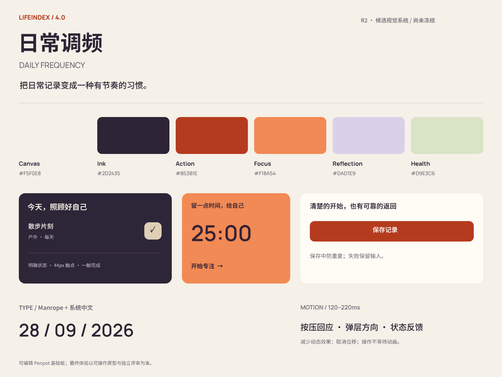

> 历史设计参考：4.0已撤回，当前产品为3.3.0。本文的定稿、实现与验收描述仅代表当时状态，不是当前实施指令。原型代码未恢复；历史原文件可在Git提交 `cea0d8b53c3686cdefb2b99f824d80e08bda5d8c` 中查看。

# LifeIndex 4.0 可编辑设计板

日期：2026-09-28。状态：R2 候选，未冻结，不代替完整交互原型和独立审核。

已通过安装好的本地 Penpot MCP 创建新的 `LifeIndex 4.0 / R2 foundations` 页面，包含 1280×960 视觉基础板、47 个可编辑子形状以及 6 项颜色库资产。使用形状、文本与颜色创建，不是把截图贴入画布。设计工程参照 Emil design engineering 的按压反馈、动效目的及减少动态效果原则。

[打开本地可编辑设计板](http://localhost:9001/#/workspace?team-id=d1de1a51-365f-81ee-8008-b52abea8ff29&file-id=d1de1a51-365f-81ee-8008-b52b753d0d6e&page-id=1a3e0fd5-5912-809c-8008-b5646e10e386)。此链接仅指向已安装的本地服务，不向线上站点发布设计服务。

- Board：`1a3e0fd5-5912-809c-8008-b5646e949013`。
- 配色取自当前 `prototype-r2/studio.css`；已同步 R2-D06 修订，功能动作色为 `#B53B1E`、次要文字为 `#706572`，鲜明的专注色块保持 `#F18A54`。
- 板上中文用 Penpot 可用的 Noto Sans SC 表达排版；应用原型采用系统中文字体。英文与数字采用 Manrope。
- 图形为原创；Manrope 许可记录在原型 assets 目录。板上的习惯与时长只为组件示意，不是实际业务数据或产品统计。
- 已读回形状与颜色，容器边界检查没有越界项；刷新后页面显示已保存，图层仍完整。PNG 导出成功并已逐图查看。SVG 工具此次返回无效内容，未作为交付导出文件。

此图只能证明候选视觉资产已落在可编辑设计工具中；触点、读写状态、离线、计时、备份和响应式的验收仍以实际原型及生产代码验证为准。
